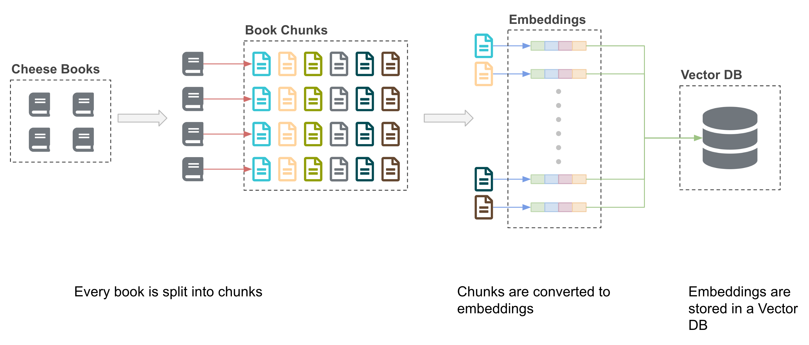
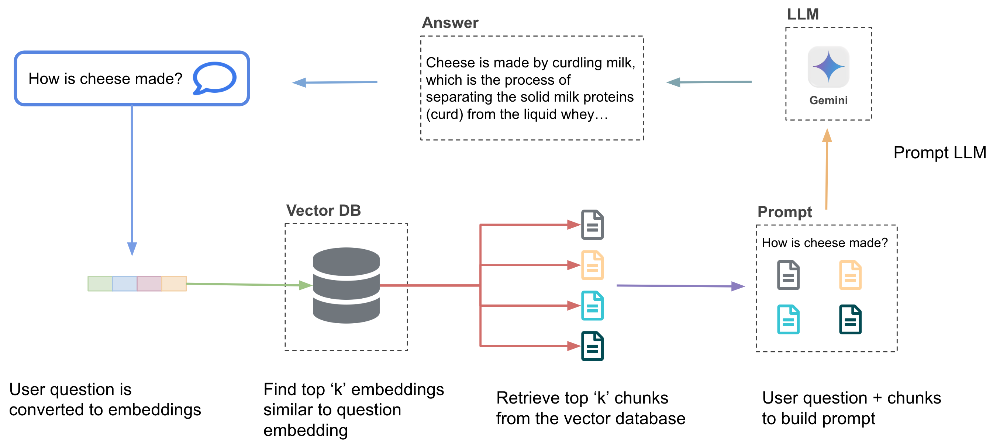
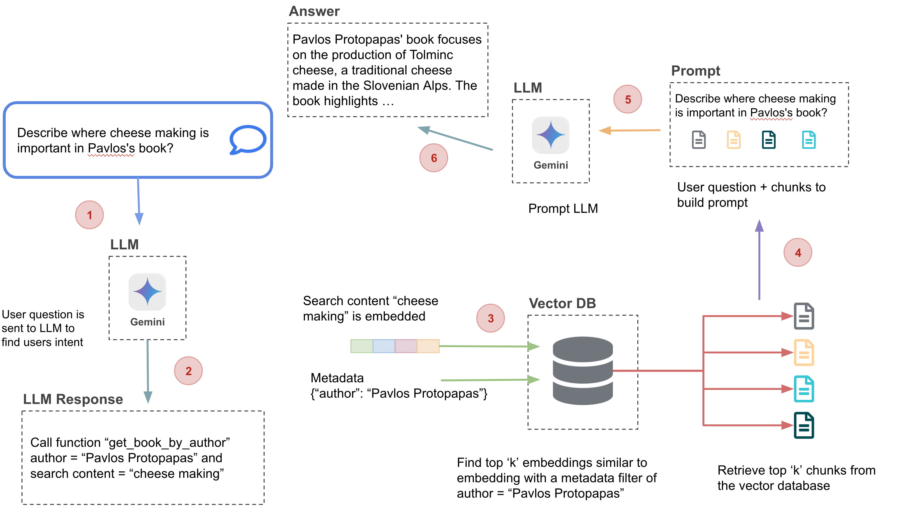

# Building a RAG System with Vector DB and LLM

In this tutorial we will build a Retrieval-Augmented Generation (RAG) system using a vector database and a Large Language Model (LLM). The system will chunk text documents, create embeddings, stores them in a vector database, and uses them to enhance LLM responses.

**Step 1:**

**Step 2:**



## Prerequisites
* Have Docker installed
* Cloned this repository to your local machine https://github.com/dlops-io/llm-rag

### Setup GCP Service Account
- To set up a service account, go to the [GCP Console](https://console.cloud.google.com/home/dashboard), search for "Service accounts" in the top search box, or navigate to "IAM & Admin" > "Service accounts" from the top-left menu. 
- Create a new service account called "llm-service-account." 
- In "Grant this service account access to project" select:
    - Storage Admin
    - Vertex AI User
- This will create a service account.
- Click the service account and navigate to the tab "KEYS"
- Click the button "ADD Key (Create New Key)" and Select "JSON". This will download a private key JSON file to your computer. 
- Copy this JSON file into the **secrets** folder and rename it to `llm-service-account.json`.

Your folder structure should look like this:

```
   |-llm-rag
   |-secrets
```

## Run LLM RAG Container
- Make sure you are inside the `llm-rag` folder and open a terminal at this location
- Run `sh docker-shell.sh`

## Chunk Documents
Run the cli.py script with the --chunk flag to split your input texts into smaller chunks. To understand more about chunking check out this [visualization](https://ac215-llm-rag.dlops.io/chunkviz). Use Chrome browser for best performance.

**Perform Character splitting:**

`python cli.py --chunk --chunk_type char-split`

**Perform Recursive Character splitting:**

`python cli.py --chunk --chunk_type recursive-split`

This will:
* Read each text file in the input-datasets/books directory
* Split the text into chunks using the specified method (character-based or recursive)
* Save the chunks as JSONL files in the outputs directory

## Generate Embeddings
Generate embeddings for the text chunks:

`python cli.py --embed --chunk_type char-split`

`python cli.py --embed --chunk_type recursive-split`

This will:
* Reads the chunk files created in the previous section
* Uses Vertex AI's text embedding model to generate embeddings for each chunk
* Saves the chunks with their embeddings as new JSONL files
* We use Vertex AI `text-embedding-004` model to generate the embeddings

## Load Embeddings into Vector Database
Load the generated embeddings into ChromaDB:

`python cli.py --load --chunk_type char-split`

`python cli.py --load --chunk_type recursive-split`

This will:
* Connects to your ChromaDB instance
* Creates a new collection (or clears an existing one)
* Loads the embeddings and associated metadata into the collection

To view the contents of your Vector Database you can use this [Chroma UI Tool](https://ac215-llm-rag.dlops.io/chromaui). Use Chrome browser for best performance.

## Query the Vector Database
Test querying the vector database:

`python cli.py --query --chunk_type char-split`

`python cli.py --query --chunk_type recursive-split`

This will:
* Generate an embedding for a sample query
* Perform similarity searches in the vector database
* Apply various types of filters on the queries

## Chat with LLM
Chat with the LLM using the RAG system:


`python cli.py --chat --chunk_type char-split`

`python cli.py --chat --chunk_type recursive-split`

This will:
* Takes a sample query
* Retrieves relevant context from the vector database
* Sends the query and context to the LLM
* Displays the LLM's response

To test out chat with LLM using RAG, you can use this [Chat Tool](https://ac215-llm-rag.dlops.io/chat). Use Chrome browser for best performance.

## Advanced RAG: Semantic Chunking (Semantic Splitting)

Run the following command to perform chunking -> embedding -> loading the vector db

`python cli.py --chunk --embed --load --chunk_type semantic-split`

This will:
* Read each text file in the input-datasets/books directory
* Split the text into chunks using semantic splitting method
* Save the chunks as JSONL files in the outputs directory
* Reads each JSONL file of chunks and converts to embeddings and saves them
* Loads each JSONL file with embeddings into the vector db

## Agents

In this section we will implement and use an AI Agent (Cheese Expert Agent) to perform question answering. AI agents are designed to perform specific tasks, answer questions, and automate processes for users. We will build an cheese agent which can perform the following tasks:
* Answer a question from a specific book given an author name
* Answer a question from any book (Similar to our RAG approach above) 

This is the flow of information as compared to the above RAG method:


Run the following command to perform

`python cli.py --agent --chunk_type char-split`

This will:
* Take the user question and pass it to LLM to find the user intent
* Perform function calling to get all the responses required to answer the question
* Pass the query and context to the LLM
* Displays the LLM's response

To test out the Cheese Agent, you can use this [Cheese Agent Tool](https://ac215-llm-rag.dlops.io/agent). Use Chrome browser for best performance.
