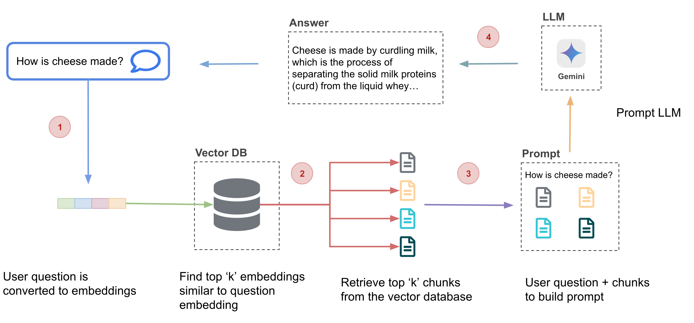

# Cheese App: RAG, API and Frontend

This is a chatbot that answers questions about cheese using a set of old cheese books. It has three parts, each in its own folder. Each part runs in Docker in its own terminal, in this order:

1. **RAG** (`llmrag`): cuts the books into small pieces, stores them in a database called Chroma, and lets you ask questions from the command line.
2. **API** (`api-service`): the backend the website talks to.
3. **Frontend** (`frontend-react`): the website.

The AI part runs on Google Cloud (Vertex AI).

**How the books get into the database**


**How a question gets answered**



## Before you start

You need Docker and a Google Cloud project. Keep the folders laid out like this:

```text
ac215/
├── secrets/              the Google key (never commit this)
├── persistent-folder/    where the API saves chat history
└── llm-rag/              this repo
    ├── llmrag/
    ├── api-service/
    └── frontend-react/
```

Create `persistent-folder` yourself, empty is fine. If Docker creates it for you, it belongs to root and the API can't write to it.

Create the Docker network the three parts talk over. This is only needed once:

```bash
docker network create cheese-app-network
```

## Google Cloud setup

This is the same as the course instructions:

1. In the Google Cloud console, go to IAM & Admin, then Service Accounts, and create one called `llm-service-account`.
2. Give it two roles: **Storage Admin** and **Vertex AI User** (newer consoles call it "Gemini Enterprise Agent Platform User").
3. Open the account, go to the Keys tab, click Add key, and choose JSON. A file downloads.
4. Rename it to `llm-service-account.json` and put it in the `secrets` folder.


You'll need your project ID in the next steps. It's the long one in the ID column of the project picker (it looks like `project-1234abcd-...`), not the number next to the organization.

## 1. Run the RAG

Put your project ID in `GCP_PROJECT` in `llmrag/docker-shell.sh`. It comes set to `ac215-project`, which is the course's project, and you'll get "permission denied" with it.

Then, from the `llmrag` folder:

```bash
sh docker-shell.sh
```

This starts the Chroma database and opens a shell inside the container.

The first time we ran it, it stopped with `docker-entrypoint.sh: No such file or directory`. The cause was in `docker-compose.yml`: it pointed at a folder called `llm-rag`, but ours is called `llmrag`, so the container got an empty folder. We changed that line to `- .:/app` and it's already fixed in this branch.

Inside the container, run these in order:

```bash
python cli.py --chunk --chunk_type char-split
python cli.py --embed --chunk_type char-split
python cli.py --load --chunk_type char-split
python cli.py --query --chunk_type char-split
python cli.py --chat --chunk_type char-split
```

In plain words: cut the books into pieces, turn each piece into numbers the AI can compare, load them into Chroma, then search and chat.

Then run the same five again with `recursive-split` instead of `char-split`. The website reads the recursive-split pieces, so its chat won't work without them.

Leave this terminal open. The API needs Chroma running.

Two extras, if you want to try them:

- `python cli.py --chunk --embed --load --chunk_type semantic-split` cuts the books by meaning instead of by length.
- `python cli.py --agent --chunk_type char-split` lets the AI decide where to search, for example only in one author's book.

## 2. Run the API

Put your project ID in `GCP_PROJECT` in `api-service/docker-shell.sh`.

Then, in a second terminal, from the `api-service` folder:

```bash
sh docker-shell.sh
```

Inside the container:

```bash
uvicorn_server
```

The API is now at http://localhost:9000, and http://localhost:9000/docs lists everything it can do.

## 3. Run the frontend

In a third terminal, from the `frontend-react` folder:

```bash
sh docker-shell.sh
```

Inside the container:

```bash
npm install
npm run dev
```

Open http://localhost:3000. The site has the podcasts, the newsletters and a chat page.

If the chat shows an error, look in the API terminal first. That's where the real cause showed up every time for us.

## Problems we hit

These are the ones not covered above. Most are already fixed in this branch, and they're listed in case you start from the course code.

| What we saw | Where | What fixed it |
| --- | --- | --- |
| `Permission denied: '/persistent/chat-history'` | API | Docker had created `persistent-folder` as root. Run `sudo chown -R $USER:$USER persistent-folder` on your own machine, not in the container. |
| `File /secrets/ml-workflow.json was not found` | API | The script pointed at the wrong folder and key name. `docker-shell.sh` now uses `../../secrets` and `llm-service-account.json` (fixed). |
| `Could not connect to a Chroma server` | API | The API and Chroma were on different Docker networks. Both now join `cheese-app-network`, and the API looks for `llm-rag-chromadb` (fixed). |
| 404 for `gemini-2.0-flash-001` | API | Google retired that model. The files in `api-service/api/utils` now use `gemini-3.5-flash` (fixed). |
| 404 for `gemini-3.5-flash` in `us-central1` | API | That model isn't offered in that region. The same files now use the `global` location (fixed). |
